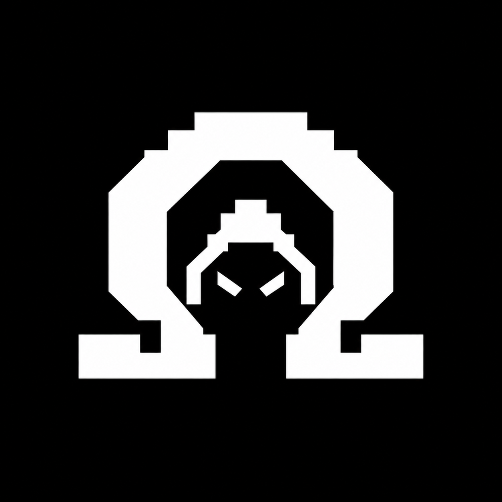

<p align="center">
  
</p>

<h1 align="center">OMEGA</h1>

<p align="center">
  <strong>A security-focused AI agent CLI.</strong><br />
  Built for authorized penetration testing, attack-surface analysis, log and incident triage,<br />
  and OSINT collection — on top of the <a href="https://github.com/earendil-works/pi">Pi agent harness</a>.
</p>

<p align="center">
  <a href="https://www.npmjs.com/package/@youmulijiang/omega"></a>
  <a href="LICENSE"></a>
  
  
  <a href="https://github.com/earendil-works/pi"></a>
  
</p>

<p align="center">
  <a href="README.md">English</a> · <a href="README.zh-CN.md">简体中文</a>
</p>

<p align="center">
  
  &nbsp;
  
  &nbsp;
  
  &nbsp;
  
  &nbsp;
  
  &nbsp;
  
  &nbsp;
  
  &nbsp;
  
  &nbsp;
  
  &nbsp;
  
</p>

> [!WARNING]
> **Authorized use only.** OMEGA is built for security testing that you have explicit permission to perform — your own systems, lab environments, CTF competitions, or engagements covered by a signed authorization. Every active step is designed to be auditable. Do not point it at targets you do not own or have written permission to test.

---

## Why OMEGA

A general-purpose coding agent will happily write you a scanner; it will not, by default, keep track of which findings are *observed* versus *inferred*, refuse to overstep an authorized scope, or hand you a report an auditor can reconstruct.

OMEGA is the [Pi agent harness](https://github.com/earendil-works/pi) with a security working style bolted on:

- **Evidence-first by construction.** The system prompt requires separating confirmed facts, reasonable inferences, and unverified hypotheses — and attaching a reproducible request, file path plus line number, or timestamp to every claim.
- **Scope-aware.** Tools and the permission layer reason about the authorized target set, so "should I send this request?" is answered by policy rather than by vibes.
- **Read-only until told otherwise.** The security subagent stays read-only unless a task explicitly authorizes changes, and verifies exploitation with a minimal-impact proof instead of dumping data.
- **Deliverables that survive review.** `/report` assembles the session into a structured Markdown penetration-test report with preconditions, reproduction steps, evidence, and remediation advice.

## Highlights

| Area | What you get |
| --- | --- |
| **Security prompts** | Composable guidance for web/API testing and for log and incident analysis, loaded on demand next to the core system prompt |
| **Security subagent** | A full-spectrum `security-worker` for code review, log analysis, OSINT, advisory review, and web pentest — with hard red lines and a read-only default |
| **Permission gate** | Three levels (`ask for approval`, `approve for me`, `full access`) plus **non-configurable deny rules** for filesystem, database, and disk destruction |
| **HTTP work** | `http_request` and `http_replay` tools for crafting, replaying, and diffing requests against an authorized target, keeping a normal request as the control |
| **Browser testing** | Chrome DevTools Protocol tooling for pages, JS evaluation, screenshots, and network capture, plus a Chrome extension bridge that drives your logged-in session (tabs, navigation, evaluation, click, type, screenshots) |
| **Background work** | Long-running commands and delegated agents tracked as tasks, with bounded logs and completion notifications instead of polling |
| **Independent verification** | `/goal` runs a task to completion and has an independent `goal-skeptic` subagent verify the claim against the actual current state |
| **Memory & knowledge** | Persistent, inspectable memory plus a searchable local knowledge base fed by `/study` |
| **MCP** | Connect Model Context Protocol servers and call their tools without leaving the session |
| **Cost visibility** | `/cost` token and spend accounting, including a per-model breakdown and HTML export |

## Install

```bash
npm install -g @youmulijiang/omega
omega
```

Requires **Node.js ≥ 22.19**. The published `omega` depends on a patched build of the coding agent, resolved automatically through an npm alias — a single global install is all you need.

Initialize a workspace (creates `.omega/` in the current directory):

```bash
omega init
```

Model providers are configured through Pi's provider registry — Anthropic, OpenAI, Google, Amazon Bedrock, and others. Supply credentials via the usual environment variables or through the agent's auth store.

## Run from source

```bash
npm install --ignore-scripts

./omega-test.sh          # Linux / macOS
.\omega-test.bat         # Windows
```

Both launchers point `OMEGA_CODING_AGENT_DIR` at the repo-local `.omega/agent`, so a source checkout keeps its own configuration, sessions, and credentials separate from a global install. Add `--no-env` to strip every provider API key from the environment for a clean-room test:

```bash
./omega-test.sh --no-env
```

The scripts run the CLI through `tsx`, so no build step is needed to exercise source changes. Windows users can also invoke `omega-test.ps1` directly.

The sidebar globe uses Unicode Braille dots on recognized modern terminals or UTF-8 locales, and falls back to ASCII for legacy, non-UTF-8, or unknown environments. Set `OMEGA_GLOBE_RENDERER=ascii` or `braille` before launch to override selection. Font glyph coverage cannot be detected reliably; force ASCII if dots appear as boxes or misalign. In PowerShell: `$env:OMEGA_GLOBE_RENDERER = "ascii"`.

## Commands

### Security workflow

| Command | Description |
| --- | --- |
| `/report` | Assemble the current session into a Markdown penetration-test report |
| `/goal [--tokens 100k] <goal>` | Run a goal to completion with an independent skeptic verifying the result |
| `/plan [task]` | Start a task in plan mode, or toggle plan mode |
| `/plan:status` | Show the current plan and progress |
| `/permissions` | Inspect or set the permission level: `ask for approval`, `approve for me`, `full access` |
| `/copy` | Copy the last assistant output to the clipboard |

### Background tasks and subagents

| Command | Description |
| --- | --- |
| `/bg [--agent] [--name "Task"] <cmd>` | Start a shell command as a tracked background task |
| `/bg:tasks`, `/bg:jobs` | Open the background task manager UI; list running and recent tasks |
| `/bg:logs <id> [maxBytes]` | Show bounded output from a background task |
| `/bg:kill <id>` | Stop a running background task |
| `/bg:fusion` | Start a fixed-purpose Fusion reason in the background and return immediately |
| `/fork:task` | Run a focused task in an isolated Omega child process |
| `/subagent:list` | List the available Omega subagents |
| `/subagents:send <id> <msg>` | Send a coordination message to a running subagent |
| `/subagents:kill [id]` | Terminate one or all running subagent tasks |
| `/subagent:settings` | Enable or disable the subagent subsystem |

### Memory, knowledge, and context

| Command | Description |
| --- | --- |
| `/memory <show\|status\|clear>` | Show, inspect, or clear stored memory |
| `/study <content>` | Study material in the background and distill it into the local knowledge base |
| `/study:list`, `/study:status` | List the knowledge index; watch the learning process |
| `/cost [models\|export]` | Session token and spend chart, per-model breakdown, HTML export |
| `/btw [question]` | Ask a side question using read-only main-conversation context; omit the question to configure or resume a side thread |
| `/todos` | Show or hide the todo execution panel |
| `/sidebar on\|off\|left\|right\|width <n\|auto>` | Control the sidebar |
| `/mcp` | Manage MCP servers, sign in, reconnect, and inspect their tools |
| `/smithery <query>` | Search Smithery and add an MCP server |
| `/chrome-devtools`, `/browser-bridge` | Chrome DevTools tooling and the extension bridge |
| `/workflows` | Inspect, run, list, validate, and manage Omega workflows |
| `/init` | Initialize `.omega/` configuration and the workflows directory |

## Tools

Beyond Pi's built-in file, search, and shell tools, OMEGA registers:

| Tool | Purpose |
| --- | --- |
| `http_request` | Send an arbitrary HTTP request with a full request line, headers, and body |
| `http_replay` | Replay a captured HTTP/1.x request with an overridden method, URL, headers, or body |
| `diff` | Line-by-line text comparison to isolate what a payload actually changed |
| `knowledge_search` | Search the local security knowledge base |
| `browser_ext` | Drive the user's real Chrome session: list and select tabs, navigate, evaluate JS, read content, click, type, screenshot, and read the session's auth state |
| `chrome_devtools_*` | Chrome DevTools Protocol tools: pages, navigation, evaluation, screenshots, network capture, and page API extraction |
| `bg_run` / `bg_status` / `bg_logs` / `bg_kill` | Track long-running commands without blocking the turn |
| `subagent` / `subagent_message` / `subagent_status` | Delegate bounded work to a specialized child agent |
| `workflow` / `structured_output` | Run a deterministic multi-step workflow script and return a typed result |
| `memory_write` / `memory_read` / `memory_search` / `memory_forget` / `memory_restore` / `memory_status` | Durable, inspectable memory |
| `scratchpad` / `todo` | Working notes and a visible checklist for multi-step execution |
| `codemode` / `mcp__<server>__<tool>` | Call MCP server tools through the built-in MCP integration |
| `fork` | Run a task in an isolated child process |

## Subagents

| Agent | Role |
| --- | --- |
| `security-worker` | Full-spectrum security work: authorized code review, log analysis, OSINT, advisory assessment, and web penetration testing. Read-only unless the task explicitly authorizes changes. |
| `goal-skeptic` | Independent completion skeptic for `/goal`. Verifies completion claims against the actual current state, matching evidence scope to requirement scope, and judges only from personally inspected evidence. |
| `explore` | Repository exploration and agent-design specialist; builds reusable project-level agents when nothing existing fits. |
| `workflow-author` | Converts natural-language requirements into constrained Omega workflow DSL scripts. |

## Architecture

OMEGA is a TypeScript monorepo in which **every customization lives in a single extension package**. Upstream Pi stays intact:

```
packages/
├── omega-core/        # All OMEGA behavior — the only package we own
├── coding-agent/      # Upstream Pi CLI (patched only by piConfig: name/configDir)
├── agent/, ai/, tui/  # Upstream Pi runtime, multi-provider LLM API, terminal UI
└── …                  # chord, durable, protocol, server, client, telemetry, evals
```

- `packages/omega-core/src/entry.ts` registers every Omega module against Pi's public `ExtensionAPI`, upgraded to a superset `OmegaAPI`.
- `packages/omega-core/src/cli-runner.ts` injects that extension factory into Pi's `main()`. The Pi kernel is not modified — no monkey-patching, no private APIs.
- Package names stay upstream-identical in the repository; only the published artifacts are renamed (`scripts/publish-omega-forks.mjs`). This keeps `git merge upstream/main` conflict-free, which is why the fork can track Pi closely.
- Source layout mirrors the feature set: `permissions/`, `prompts/`, `subagents/`, `workflows/`, `memory/`, `knowledge/`, `goal/`, `tools/`, `chrome/`, `background/`, `mcp/`.

The application icon is [`icon/omega.ico`](icon/omega.ico), with [`icon/omega.png`](icon/omega.png) as its raster form.

## Development

```bash
npm install --ignore-scripts   # hydrate dependencies without lifecycle scripts
npm run build                  # refresh model data, then build all packages
npm run check                  # lint, format, type check, and repo invariants
./test.sh                      # run tests (skips LLM-dependent tests without keys)
./omega-test.sh                # run the CLI from source
```

`npm run check` is the gate to satisfy before finishing a change; see [AGENTS.md](AGENTS.md) for the project's development rules.

## Upstream

OMEGA would not exist without [Pi](https://github.com/earendil-works/pi) by Mario Zechner and the earendil-works contributors. Upstream is tracked as the `upstream` remote:

```bash
git fetch upstream
git merge upstream/main
```

Because all Omega behavior sits behind the extension API, syncing upstream is an ordinary merge rather than a fork reconciliation.

## Author

**youmulijiang** — [github.com/youmulijiang](https://github.com/youmulijiang)

## License

[MIT](LICENSE). OMEGA is a derivative work of Pi, which is also MIT licensed; the original copyright notice is retained in [LICENSE](LICENSE).
