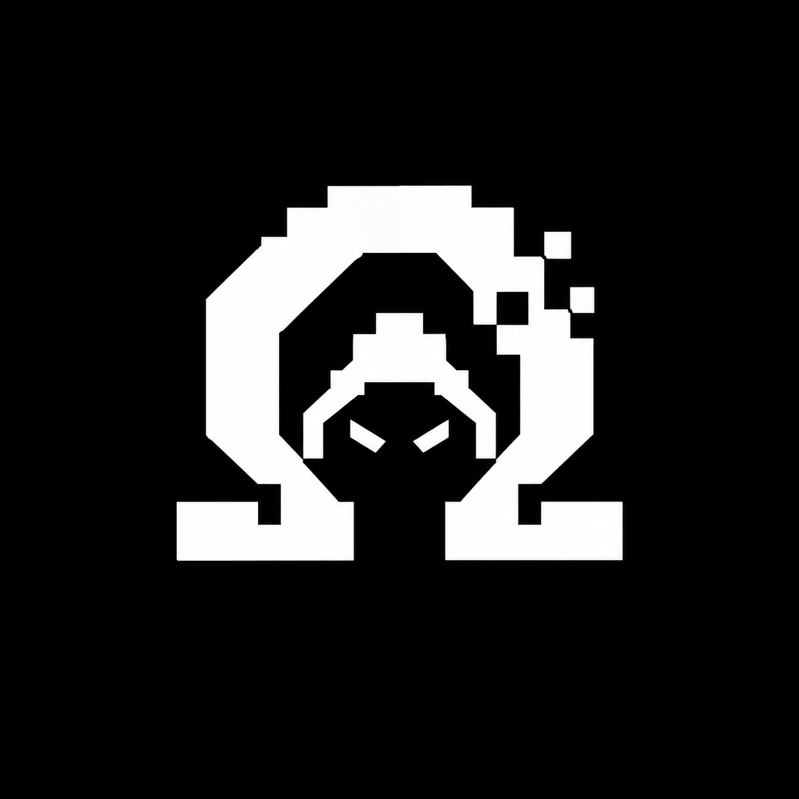

<p align="center">
  
</p>

<h1 align="center">OMEGA</h1>

<p align="center">
  <strong>面向网络安全的 AI Agent CLI。</strong><br />
  为授权范围内的渗透测试、攻击面分析、日志与事件研判、OSINT 情报收集而构建，<br />
  基于 <a href="https://github.com/earendil-works/pi">Pi agent harness</a> 二次开发。
</p>

<p align="center">
  <a href="https://www.npmjs.com/package/@youmulijiang/omega"></a>
  <a href="LICENSE"></a>
  
  
  <a href="https://github.com/earendil-works/pi"></a>
  
</p>

<p align="center">
  <a href="README.zh-CN.md">简体中文</a> · <a href="README.md">English</a>
</p>

<p align="center">
  
  &nbsp;
  
  &nbsp;
  
  &nbsp;
  
  &nbsp;
  
  &nbsp;
  
  &nbsp;
  
  &nbsp;
  
  &nbsp;
  
  &nbsp;
  
</p>

> [!WARNING]
> **仅限授权使用。** OMEGA 面向你有明确授权开展的安全测试：自有系统、实验靶场、CTF 比赛，或已签署授权书的项目。其每一步主动操作都以可审计为设计目标。请勿将本工具用于你并不拥有、也未获得书面授权的目标。

---

## 为什么需要 OMEGA

通用编码 Agent 会乐于帮你写一个扫描器,但它默认不会区分哪些结论是**实测所得**、哪些只是**推断**,不会自我约束在授权范围之内,也给不出一份审计人员能够复现的报告。

OMEGA 是 [Pi agent harness](https://github.com/earendil-works/pi) 加上一套安全工作方式:

- **从机制上以证据为先。** 系统提示词要求把「确认的事实 / 合理的推断 / 未经验证的假设」三类结论分开陈述,并要求每条结论都附带可复现的请求、文件路径加行号,或时间戳。
- **范围感知。** 工具与权限层会参考授权目标集合来判断「这个请求该不该发」,由策略而非感觉来决定。
- **默认只读。** 安全子代理在任务未明确授权改动前保持只读;验证漏洞时采用最小影响的证明,而不是把数据拖走。
- **交付物经得起复核。** `/report` 会把当前会话整理为结构化的 Markdown 渗透测试报告,包含前置条件、复现步骤、证据与修复建议。

## 核心能力

| 能力 | 说明 |
| --- | --- |
| **安全提示词** | 按需加载的 Web/API 测试指引与日志、事件研判指引,与核心系统提示词协作 |
| **安全子代理** | 全谱系 `security-worker`:代码审计、日志分析、OSINT、方案评审、Web 渗透测试;设有硬性红线,默认只读 |
| **权限门控** | 三档权限(`ask for approval` / `approve for me` / `full access`),外加**不可配置的拒绝规则**,覆盖文件系统、数据库与磁盘破坏性操作 |
| **HTTP 操作** | `http_request` 与 `http_replay` 用于构造、重放、对比请求,并始终保留一条正常请求作为对照 |
| **浏览器测试** | Chrome DevTools Protocol 工具链,覆盖页面、JS 执行、截图与网络抓包;另有 Chrome 扩展桥,可直接驱动你已登录的浏览器会话(标签页、导航、执行、点击、输入、截图) |
| **后台任务** | 长耗时命令与委派的子代理以任务形式跟踪,提供有界日志与完成通知,而非轮询 |
| **独立验证** | `/goal` 把任务推进到完成,并由独立的 `goal-skeptic` 子代理对照真实状态核验完成声明 |
| **记忆与知识库** | 持久且可检视的记忆,以及由 `/study` 持续沉淀的可检索本地知识库 |
| **MCP** | 接入 Model Context Protocol 服务器并直接调用其工具,无需离开当前会话 |
| **成本可见** | `/cost` 统计 Token 与费用,支持按模型明细与 HTML 报表导出 |

## 安装

```bash
npm install -g @youmulijiang/omega
omega
```

需要 **Node.js ≥ 22.19**。发布到 npm 的 `omega` 依赖一份打过补丁的 coding agent,通过 npm alias 自动解析,一次全局安装即可。

初始化工作目录(在当前目录创建 `.omega/`):

```bash
omega init
```

模型服务通过 Pi 的 provider 注册表接入,涵盖 Anthropic、OpenAI、Google、Amazon Bedrock 等。凭据可经由常规环境变量或 Agent 自身的凭据存储提供。

## 从源码运行

```bash
npm install --ignore-scripts

./omega-test.sh          # Linux / macOS
.\omega-test.bat         # Windows
```

两个启动脚本都会把 `OMEGA_CODING_AGENT_DIR` 指向仓库内的 `.omega/agent`,因此源码检出环境拥有独立的配置、会话与凭据,不会与全局安装相互干扰。加上 `--no-env` 可清空环境中的全部服务商密钥,用于干净环境测试:

```bash
./omega-test.sh --no-env
```

脚本通过 `tsx` 直接运行 CLI,因此修改源码后无需构建即可验证。Windows 下也可直接运行 `omega-test.ps1`。

## 命令

### 安全工作流

| 命令 | 说明 |
| --- | --- |
| `/report` | 将当前会话整理为 Markdown 渗透测试报告 |
| `/goal [--tokens 100k] <目标>` | 将目标推进至完成,并由独立 skeptic 子代理核验结果 |
| `/plan [任务]` | 以计划模式启动任务,或切换计划模式 |
| `/plan:status` | 查看当前计划与进度 |
| `/permissions` | 查看或设置权限等级:`ask for approval` / `approve for me` / `full access` |
| `/copy` | 复制上一条助手输出到剪贴板 |

### 后台任务与子代理

| 命令 | 说明 |
| --- | --- |
| `/bg [--agent] [--name "任务名"] <命令>` | 以受跟踪的后台任务方式启动 shell 命令 |
| `/tasks`、`/jobs` | 打开后台任务管理器 UI;列出运行中与近期任务 |
| `/logs <id> [maxBytes]` | 查看后台任务的有界输出 |
| `/kill <id>` | 终止正在运行的后台任务 |
| `/fusion` | 在后台启动固定用途的 Fusion 推理并立即返回 |
| `/fork:task` | 在独立的 Omega 子进程中执行聚焦任务 |
| `/subagent:list` | 列出当前可用的 Omega 子代理 |
| `/subagents:send <id> <消息>` | 向运行中的子代理发送协调消息 |
| `/subagents:kill [id]` | 终止一个或全部运行中的子代理任务 |
| `/subagent:settings` | 启用或禁用子代理功能 |

### 记忆、知识与上下文

| 命令 | 说明 |
| --- | --- |
| `/memory <show\|status\|clear>` | 查看、检视或清空已存储的记忆 |
| `/study <内容>` | 在后台学习指定内容,蒸馏后写入本地知识库 |
| `/study:list`、`/study:status` | 列出知识库索引;实时查看学习过程 |
| `/cost [models\|export]` | 会话 Token 与费用图表、按模型明细、HTML 导出 |
| `/btw [问题]` | 结合主会话只读上下文提问；省略问题可配置或恢复侧线对话 |
| `/todos` | 显示或隐藏待办执行面板 |
| `/sidebar on\|off\|left\|right\|width <列数\|auto>` | 控制侧边栏 |
| `/mcp` | 管理 MCP 服务器、登录、重连并检视其工具 |
| `/smithery <查询>` | 搜索 Smithery 并添加 MCP 服务器 |
| `/chrome-devtools`、`/browser-bridge` | Chrome DevTools 工具与扩展桥 |
| `/workflows` | 查看、运行、列出、校验与管理 Omega workflows |
| `/init` | 初始化 `.omega/` 配置与 workflows 目录 |

## 工具

在 Pi 内置的文件、搜索、Shell 工具之外,OMEGA 额外注册:

| 工具 | 用途 |
| --- | --- |
| `http_request` | 以完整的请求行、请求头与请求体发送任意 HTTP 请求 |
| `http_replay` | 重放已捕获的 HTTP/1.x 请求,可覆盖方法、URL、请求头或请求体 |
| `diff` | 逐行文本比对,定位 payload 究竟改变了什么 |
| `knowledge_search` | 检索本地安全知识库 |
| `browser_ext` | 驱动用户真实的 Chrome 会话:列出与切换标签页、导航、执行 JS、读取内容、点击、输入、截图,并读取会话登录态 |
| `chrome_devtools_*` | Chrome DevTools Protocol 工具:页面、导航、执行、截图、网络抓包、页面 API 提取 |
| `bg_run` / `bg_status` / `bg_logs` / `bg_kill` | 跟踪长耗时命令而不阻塞当前轮次 |
| `subagent` / `subagent_message` / `subagent_status` | 将边界清晰的工作委派给专用子代理 |
| `workflow` / `structured_output` | 运行确定性的多步骤 workflow 脚本并返回结构化结果 |
| `memory_write` / `memory_read` / `memory_search` / `memory_forget` / `memory_restore` / `memory_status` | 持久且可检视的记忆 |
| `scratchpad` / `todo` | 过程记录与多步骤执行的可见清单 |
| `codemode` / `mcp__<server>__<tool>` | 通过内置 MCP 集成调用服务器工具 |
| `fork` | 在独立子进程中执行任务 |

## 子代理

| 子代理 | 职责 |
| --- | --- |
| `security-worker` | 全谱系安全工作:授权范围内的代码审计、日志分析、OSINT、方案评审与 Web 渗透测试。除任务明确授权改动外,保持只读。 |
| `goal-skeptic` | `/goal` 的独立完成度核验者。对照真实状态检验完成声明,要求证据范围与需求范围相匹配,仅凭亲自检视的证据下判断。 |
| `explore` | 仓库探查与 Agent 设计专家;当既有内置或项目代理均不适用时,构建可复用的项目级代理。 |
| `workflow-author` | 把自然语言需求转换为受限的 Omega workflow DSL 脚本。 |

## 架构

OMEGA 是一个 TypeScript monorepo,其中**全部定制逻辑集中在同一个扩展包内**,上游 Pi 保持原样:

```
packages/
├── omega-core/        # 全部 OMEGA 行为 —— 唯一由本项目拥有的包
├── coding-agent/      # 上游 Pi CLI(仅 piConfig 中的 name/configDir 被修改)
├── agent/, ai/, tui/  # 上游 Pi 运行时、多服务商 LLM API、终端 UI
└── …                  # chord、durable、protocol、server、client、telemetry、evals
```

- `packages/omega-core/src/entry.ts` 基于 Pi 公开的 `ExtensionAPI`(升级为超集 `OmegaAPI`)注册全部 Omega 模块。
- `packages/omega-core/src/cli-runner.ts` 把该扩展工厂注入 Pi 的 `main()`。Pi 内核零修改 —— 不打补丁、不依赖私有 API。
- 仓库内包名与上游保持一致,仅发布产物改名(`scripts/publish-omega-forks.mjs`)。这让 `git merge upstream/main` 保持无冲突,也是本项目能紧跟上上游的原因。
- 源码目录与功能一一对应:`permissions/`、`prompts/`、`subagents/`、`workflows/`、`memory/`、`knowledge/`、`goal/`、`tools/`、`chrome/`、`background/`、`mcp/`。

应用图标为 [`icon/omega.ico`](icon/omega.ico),其位图形式为 [`icon/omega.png`](icon/omega.png)。

## 开发

```bash
npm install --ignore-scripts   # 安装依赖,不执行生命周期脚本
npm run build                  # 刷新模型数据后构建全部包
npm run check                  # lint、格式化、类型检查与仓库约束校验
./test.sh                      # 运行测试(无 API Key 时跳过依赖 LLM 的用例)
./omega-test.sh                # 从源码运行 CLI
```

完成改动前需通过 `npm run check`;项目开发规则见 [AGENTS.md](AGENTS.md)。

## 上游同步

没有 [Pi](https://github.com/earendil-works/pi)(作者 Mario Zechner 及 earendil-works 贡献者)就没有 OMEGA。上游以 `upstream` remote 跟踪:

```bash
git fetch upstream
git merge upstream/main
```

由于全部 Omega 行为都收敛在扩展 API 之后,同步上游是一次常规 merge,而非 fork 调和。

## 作者

**youmulijiang** — [github.com/youmulijiang](https://github.com/youmulijiang)

## 许可证

[MIT](LICENSE)。OMEGA 是 Pi 的衍生作品,Pi 同样以 MIT 授权,原始版权声明保留在 [LICENSE](LICENSE) 中。
