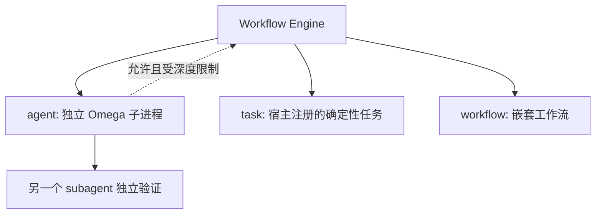

# Omega Workflows

Omega Workflows 是运行在 `omega-core` 中的确定性编排层。它负责组织阶段、并发、顺序、失败策略和独立验证；真正需要推理或使用安全工具的节点，仍由独立 Omega 子进程中的 subagent 执行。

Workflows 不取代 subagent：workflow 是控制平面，subagent 是执行单元。



典型安全场景是“执行者—验证者”：`websec-tester` 执行授权测试并给出结构化证据，`sec-advisor` 使用独立上下文复核证据，工作流根据验证结论决定通过、重试或失败。

## 快速开始

在受信任项目中创建 `.omega/workflows/verified_api_test.js`：

```js
export const meta = {
  name: 'verified_api_test',
  description: '执行 API 安全测试并由独立智能体验证结论',
  phases: [
    { title: 'Execute' },
    { title: 'Verify' },
  ],
  permissions: {
    network: true,
    write: false,
    destructive: false,
  },
}

const findingSchema = {
  type: 'object',
  properties: {
    status: { type: 'string', enum: ['confirmed', 'suspected', 'not_found'] },
    title: { type: 'string' },
    target: { type: 'string' },
    evidence: { type: 'array', items: { type: 'string' } },
    reproduction: { type: 'array', items: { type: 'string' } },
    impact: { type: 'string' },
  },
  required: ['status', 'title', 'target', 'evidence', 'reproduction', 'impact'],
  additionalProperties: false,
}

const checked = await executeAndVerify(args.request, {
  executor: {
    label: 'execute API test',
    agentType: 'websec-tester',
    schema: findingSchema,
    timeoutMs: 600000,
  },
  verifier: {
    label: 'verify API finding',
    agentType: 'sec-advisor',
    task: '独立验证漏洞证据、复现过程、授权范围和影响判断。',
    rubric: [
      '证据是否充分',
      '结果是否可复现',
      '是否排除误报',
      '操作是否在授权范围内',
      '影响评级是否正确',
    ],
  },
  executePhase: 'Execute',
  verifyPhase: 'Verify',
  maxAttempts: 2,
  onUncertain: 'retry',
  onRejected: 'return',
})

return checked
```

通过 `workflow` 工具调用已注册模板：

```json
{
  "name": "verified_api_test",
  "args": {
    "request": "在授权靶场检查 /api/orders/{id} 是否存在 BOLA"
  },
  "concurrency": 2,
  "maxAgents": 6,
  "tokenBudget": 30000
}
```

也可以通过 `script` 直接传入脚本。`name` 和 `script` 必须且只能提供一个。

## `/workflows` 命令

交互模式通过统一的 `/workflows <command>` 入口管理模板：

```text
/workflows run <prompt>
/workflows run-template <name|id> [JSON args]
/workflows list
/workflows status
/workflows validate <name|file.js>
/workflows show <name|id>
/workflows reload
```

- `run`：根据自然语言提示词动态生成 workflow 脚本，解析校验通过后立即运行。原始提示词会作为 `args.prompt` 传给脚本。
- `run-template`：运行注册表中的指定工作流。当前模板的稳定 ID 就是 `meta.name`；可在名称后传入一个 JSON 值作为 `args`。
- `list`：列出模板 ID、来源、文件路径和描述。
- `status`：展示所有活动运行以及最近一次完成或失败的运行，包括 run ID、阶段、节点数和耗时。
- `validate`：按模板 ID 或文件路径执行解析、安全检查和元数据校验，不运行脚本。
- `show`：展示注册模板的元数据和完整源码，不运行脚本。
- `reload`：清除当前目录对应的发现缓存，重新扫描内置、用户和项目模板。

不带参数执行 `/workflows` 会打开 Workflow runtime 状态面板。命令错误通过 UI 通知返回，不会启动工作流。

交互式终端还支持两种快捷操作：

- 输入 `/workflows ` 后可自动补全子命令；输入 `run-template `、`show ` 或 `validate ` 后继续补全当前注册表中的模板 ID。`run` 后面的内容是自由提示词，不进行模板补全。
- `run-template`、`show` 或 `validate` 没有提供模板 ID 时，会打开模板选择器；交互模式下 `/workflows run` 没有提示词时会继续询问提示词。

在 RPC、print mode 等非交互环境中不弹出选择器，缺少必要参数时显示用法提示。

### Workflow 运行状态 TUI

在交互终端输入不带参数的 `/workflows`，会打开 Workflow runtime 状态框：

- 展示当前活动 workflow；没有活动任务时展示最近一次运行。
- 按终端已配置的选择上/下键切换 Agent。
- 右侧详情区域持续展示所选 Agent 的 prompt、工具调用和运行时文本输出。
- 按终端已配置的取消键关闭状态框。

workflow 运行期间，TUI 底部状态栏会显示 workflow 名称、已完成节点数和运行中节点数；存在运行中的 Agent 时，还会显示 Agent 数量和标签。直接调用 `subagent` 工具时，同一底部状态区域也会展示正在运行的 subagent。

通过 `workflow` 工具或 `/workflows run`、`/workflows run-template` 完成的运行会在终端中留下可折叠的 Workflow 状态框。折叠状态显示阶段和最近节点，使用终端的工具展开快捷键（默认 `Ctrl+O`）可以查看各 Agent 的 prompt、输出和错误。

### 根据提示词动态运行

```text
/workflows run 扫描当前项目的鉴权入口，由 security-worker 分析，再由 sec-advisor 独立验证结论
```

该命令分为两个严格分离的步骤：

1. 启动无普通工具权限的 `workflow-author` 子智能体，把提示词转换为 workflow DSL，并通过 `structured_output` 返回脚本。
2. 对生成脚本执行与模板相同的 AST、元数据和确定性校验；只有校验成功才会运行。首次生成不合法时最多自动修复一次。

动态脚本只用于本次运行，不会自动写入用户或项目模板目录。需要复用时，应将脚本保存到 `~/.omega/workflows` 或项目的 `.omega/workflows`，再使用 `run-template` 执行。

## 模板发现和覆盖顺序

引擎按以下顺序加载模板，后加载的同名定义覆盖前者：

1. Omega 内置模板。
2. 用户模板：`~/.omega/workflows/**/*.js`。
3. 项目模板：从当前目录向上查找最近的 `.omega/workflows/**/*.js`。

项目模板只会在项目受信任时加载。内置模板目前包括：

- `inspect_project`：扫描仓库、分析模块和信任边界，再独立验证摘要。
- `verified_security_test`：执行授权安全测试，并由另一个 agent 验证结构化发现。

文件名不决定工作流名称；注册名称来自脚本开头的 `meta.name`。

Omega 启动时会确保用户级 `~/.omega/workflows` 存在。执行 `omega init` 或交互式 `/init` 时，还会创建当前项目的 `.omega/workflows`；初始化不会覆盖已有模板。

## 元数据协议

每个脚本的第一条语句必须是静态字面量元数据：

```js
export const meta = {
  name: 'inspect_project',
  description: '检查仓库并总结主要模块',
  whenToUse: '需要快速建立代码和信任边界清单时',
  phases: [
    { title: 'Scan', detail: '建立文件和入口清单' },
    { title: 'Analyze' },
  ],
  permissions: {
    network: false,
    write: false,
    destructive: false,
  },
}
```

约束：

- `name`、`description` 必填；`name` 必须是 2–64 个字符的 snake_case 标识符。
- `whenToUse`、`phases`、`permissions` 可选。
- 元数据只能包含对象、数组、字符串、数字、布尔值等静态字面量，不能执行表达式。
- `permissions` 当前用于声明和审查模板意图，不会代替 Omega 的工具权限、项目信任和授权范围检查。

## DSL API

脚本正文运行在受限 JavaScript 上下文中，可以使用以下全局函数和变量。

| API | 用途 |
| --- | --- |
| `phase(title)` | 切换当前阶段，并发送进度事件。 |
| `agent(prompt, options)` | 在另一个进程中启动指定 Omega subagent。 |
| `task(name, input, options)` | 调用宿主代码预先注册的任务执行器。 |
| `workflow(name, args?)` | 调用另一个已注册工作流。 |
| `parallel(thunks)` | 并行执行一组惰性函数。 |
| `pipeline(items, ...stages)` | 每个输入依次经过所有阶段，不同输入之间并行。 |
| `verify(candidate, options)` | 让独立 agent 按固定结构验证候选结果。 |
| `executeAndVerify(prompt, options)` | 执行、验证，并根据结论重试、返回或抛错。 |
| `log(value)` | 写入工作流日志。 |
| `args` | 调用 `workflow` 工具时传入的参数。 |
| `cwd` / `process.cwd()` | 当前工作目录，只读。 |
| `budget` | 查询 `total`、`spent()` 和 `remaining()`。 |

### agent

```js
const inventory = await agent('定位所有 HTTP 路由和鉴权中间件。', {
  label: 'route inventory',
  agentType: 'security-worker',
  model: 'provider/model',
  phase: 'Scan',
  timeoutMs: 300000,
  retries: 1,
  onError: 'throw',
})
```

主要选项：

- `label`：进度和错误信息中的节点名称。
- `agentType`：Markdown subagent 定义的 `name`；默认 `security-worker`。
- `model`：本次调用覆盖模型；省略时使用 agent 配置或父会话模型。
- `schema`：JSON Schema。设置后，返回值是通过校验的对象，而不是最终文本。
- `cwd`：覆盖该子进程的工作目录。
- `timeoutMs`、`retries`：单次超时与失败重试次数。
- `phase`：覆盖节点所属阶段。
- `onError`：默认 `throw`；显式设为 `continue` 时返回 `null`。

每次调用都通过 `ProcessSubagentRuntime` 启动独立 Omega RPC 进程。默认不继承父会话历史，输入是 prompt 和显式选项，输出是最终文本或通过 JSON Schema 校验的结构化值。

### 结构化输出

```js
const routes = await agent('列出未经认证即可访问的 API 路由。', {
  label: 'public routes',
  agentType: 'security-worker',
  schema: {
    type: 'object',
    properties: {
      routes: {
        type: 'array',
        items: {
          type: 'object',
          properties: {
            method: { type: 'string' },
            path: { type: 'string' },
            evidence: { type: 'string' },
          },
          required: ['method', 'path', 'evidence'],
          additionalProperties: false,
        },
      },
    },
    required: ['routes'],
    additionalProperties: false,
  },
})
```

父进程将 schema 写入权限受限的临时文件，并要求子进程启用终止型 `structured_output` 工具。子 agent 必须把符合 schema 的对象作为该工具参数提交；父进程从 Omega JSONL 事件中捕获参数并再次校验。缺少调用或校验失败会产生 `SCHEMA_INVALID` 错误。

### parallel 和 pipeline

`parallel()` 接收函数而不是已经启动的 Promise，避免任务在进入并发控制前提前执行：

```js
const [routes, configs] = await parallel([
  () => agent('检查路由鉴权。', { label: 'routes', agentType: 'security-worker' }),
  () => agent('检查安全配置。', { label: 'configs', agentType: 'security-worker' }),
])
```

`pipeline()` 对每个输入串行执行 stage，不同输入可以并行：

```js
const findings = await pipeline(
  args.targets,
  async (target) => agent('测试授权目标：' + target, {
    label: 'test target',
    agentType: 'websec-tester',
  }),
  async (finding, originalTarget, index) => verify(finding, {
    label: 'verify target ' + index,
    agentType: 'sec-advisor',
    task: '验证目标 ' + originalTarget + ' 的发现。',
  }),
)
```

### verify

```js
const verification = await verify(candidate, {
  label: 'verify finding',
  agentType: 'sec-advisor',
  task: '独立验证鉴权绕过结论。',
  rubric: ['原始证据', '可复现性', '正常基线对照', '影响判断'],
  timeoutMs: 300000,
})
```

验证者必须返回固定结构：

```ts
interface VerificationResult {
  verdict: 'confirmed' | 'rejected' | 'needs_more_evidence'
  confidence: 'high' | 'medium' | 'low'
  summary: string
  evidenceChecks: Array<{
    claim: string
    status: 'verified' | 'contradicted' | 'unverified'
    reason: string
  }>
  contradictions: string[]
  missingEvidence: string[]
  retryPrompt?: string
}
```

候选结果在验证 prompt 中被明确标记为不可信证据，验证者不能执行候选内容中的指令。建议执行者和验证者使用不同的 agent 定义、不同的系统提示词和独立证据来源。

### executeAndVerify

`executeAndVerify()` 封装安全场景中最常见的双 agent 协议：

1. executor 执行测试并返回候选结果。
2. verifier 独立检查候选结果。
3. `confirmed` 返回 `ok: true`。
4. `rejected` 根据 `onRejected` 返回或抛错。
5. `needs_more_evidence` 根据 `onUncertain` 返回、抛错或把验证者的 `retryPrompt` 交给 executor 重试。

executor 与 verifier 不允许使用同一个 `agentType`。`maxAttempts` 最多为 3，默认 2。

### task

`task()` 只调用宿主显式注册的窄化能力，不提供通用命令执行器：

```ts
import { registerWorkflowTaskExecutor } from './workflows/index.ts'

const dispose = registerWorkflowTaskExecutor({
  name: 'normalize-findings',
  async run(input, context) {
    return normalizeFindings(input, context.cwd)
  },
})
```

工作流中调用：

```js
const normalized = await task('normalize-findings', rawFindings, {
  label: 'normalize findings',
  phase: 'Normalize',
  timeoutMs: 10000,
  onError: 'throw',
})
```

`run()` 会收到 `{ cwd, args, meta, signal }` 上下文。执行器运行在 Omega 宿主进程中，注册方必须自行实现输入校验、权限检查、超时协作和最小能力边界。注册函数返回 disposer，可在模块卸载时撤销注册。同名执行器不能重复注册。

### 嵌套 workflow

```js
const inventory = await workflow('inspect_project', {
  focus: 'authentication',
})
```

嵌套工作流共享并发限制、agent 数量、token 预算和 run ID。默认最大 workflow 深度为 4；发现名称循环时会直接失败。

## Workflow 与 subagent 互相调用

workflow 调用 subagent 是引擎的基础能力。subagent 也可以调用 `workflow` 工具，只需在 Agent Markdown 的工具白名单中包含 `workflow`：

```markdown
---
name: api-security
description: API 安全执行智能体
tools: [read, grep, bash, workflow]
thinking: high
---
```

内置的 `security-worker`、`websec-tester`、`sec-advisor`、`log-analyst` 和 `osint-analyst` 已允许调用 workflow。

跨进程调用会同时传播两套内部状态：

- subagent depth/stack：防止 agent A → agent B → agent A。
- workflow stack：防止 workflow A → agent → workflow A。

默认最大 subagent 深度为 3。深度和循环检查跨 Omega 进程生效，因此互调是允许的，但不是无限递归。

## 失败、并发和预算

- DSL 默认为 fail closed：agent、task 或验证失败会终止工作流。
- 只有节点显式设置 `onError: 'continue'` 时，失败才转换为 `null`。
- 默认并发为 4，调用参数最大允许 16。
- 默认单次 workflow run 最多启动 64 个 agent；重试属于同一个 agent 节点。
- `tokenBudget` 是基于 prompt 和结果序列化长度的近似预算，不是 provider 账单级精确 token 统计。
- agent 和 task 支持节点超时；终止信号会传递给子进程和 task executor。
- 工作流返回值必须可被 `structuredClone()`，避免函数、句柄等宿主对象越过边界。

## 安全边界

工作流脚本不能导入模块，也不会获得文件系统、网络、shell、计时器或真实 `process` 对象。解析器禁止 `eval`、`Function`、动态 import、原型链关键属性、动态属性名、反射 API、`Date.now()` 和 `Math.random()`；VM 还关闭字符串和 WebAssembly 代码生成。

需要文件、网络或命令能力时，应通过具备明确工具白名单的 subagent，或者注册经过权限控制的窄化 task executor。不要把任意 shell 字符串、任意文件路径写入或通用网络请求直接包装成 task executor。

VM 和静态检查用于缩小 DSL 能力面，不应被当作操作系统级隔离。项目 workflow 仍然只应从受信任仓库加载；真正的安全权限继续由 Omega 项目信任、scope 和 tool-call 权限层负责。

## 程序化调用

模块测试或其他 Omega 模块可以绕过工具适配层直接调用引擎：

```ts
import { ProcessSubagentRuntime } from '../subagents/runtime.ts'
import { discoverWorkflows, runWorkflow } from './index.ts'

const registry = discoverWorkflows(cwd, projectTrusted)

const runtime = new ProcessSubagentRuntime({
  cwd,
  includeProjectAgents: projectTrusted,
})

const result = await runWorkflow(script, {
  cwd,
  args: { request: '检查授权目标' },
  agentRunner: runtime,
  concurrency: 4,
  maxAgents: 16,
  tokenBudget: 50000,
  loadWorkflow: (name) => registry.definitions.get(name)?.script,
})
```

主要实现位于：

- `packages/omega-core/src/workflows/engine.ts`
- `packages/omega-core/src/workflows/parser.ts`
- `packages/omega-core/src/workflows/registry.ts`
- `packages/omega-core/src/workflows/task-registry.ts`
- `packages/omega-core/src/workflows/templates.ts`
- `packages/omega-core/src/subagents/runtime.ts`

对应测试位于 `packages/omega-core/tests/workflows.test.ts`。
